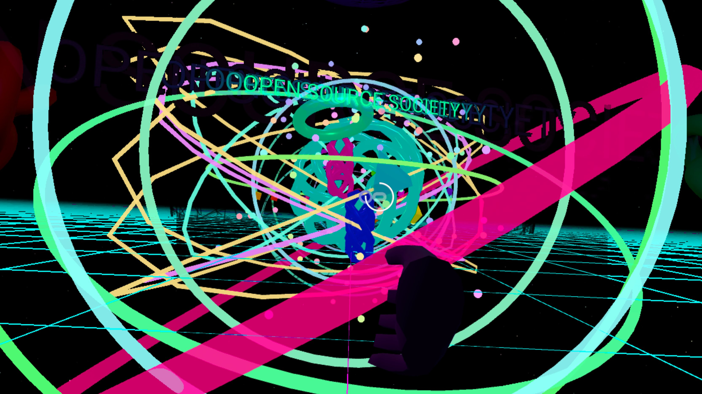
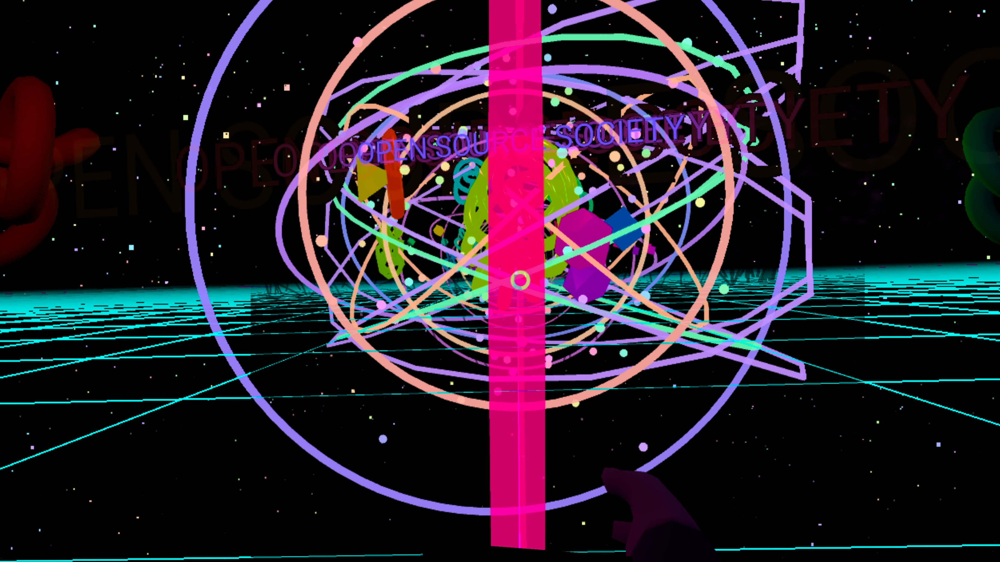

# Open Source Society — Psychedelic VR Experience

A standalone WebXR experience packaged as an Android APK for Meta Quest headsets. No internet connection required at runtime.

---

## Screenshots




---

## What it is

A psychedelic, disorienting virtual reality environment designed to evoke the kind of physical and mental confusion you get on a roller coaster or during a psychedelic experience. It is themed around **Open Source Society** — a glowing, pulsing text piece floats at the centre of the world.

The experience uses a set of 7 psychological fear/disorientation effects drawn from research into vestibular disruption, looming threat responses, and altered perception. They cycle randomly so the viewer can never fully adapt to any one of them.

### The 7 effects (each lasts ~2 minutes, triggers unpredictably)

| Effect | What it does |
|---|---|
| **Height Drop** | The floor falls away into an abyss, triggering height vertigo |
| **Horizon Loss** | The world rolls and tilts, destroying your sense of up/down |
| **Flow Surge** | The tunnel rushes toward you at high speed (optic flow overload) |
| **Looming** | Large objects fly directly at your face (threat response) |
| **Strobe Flash** | Irregular 0.5–3 Hz light strobing (disorientation, mild photosensitivity) |
| **Scale Shift** | The entire world shrinks and expands, warping your spatial sense |
| **Vortex Spin** | The world rotates around you (vestibular conflict) |

Between effects there is a 10–20 second "calm" period, then a new randomly chosen one begins. A 28-second warmup plays on load before any effect starts.

### Environment

- Deep space background: 5,000 static stars with realistic colour distribution (blue-white, yellow-white, orange giants) plus a subtle twinkle
- Five coloured nebula clouds (purple, blue, pink, teal, deep violet)
- A psychedelic colour-cycling tunnel with bidirectional ring movement driven by irrational-frequency sine sums — movement never repeats or locks into a rhythm
- Glowing "OPEN SOURCE SOCIETY" text at the centre
- Chaotic geometry: torus knots, acid ribbons, sphere swarms, a mandala, a floor grid

### Firework gun

Pull the trigger on either controller to fire a glowing projectile. It flies forward with gravity and explodes into a 100-point rainbow burst with additive blending.

---

## Requirements

- Meta Quest 2, 3, or Pro headset
- Linux/Mac/Windows machine with Android SDK and ADB to build and install
- Java 17 JDK
- Node.js ≥ 18

---

## Setup

```bash
# Install Node dependencies (Capacitor 6.2.2)
npm install

# Set Java 17 (required — Java 18+ breaks the Gradle build)
export JAVA_HOME=/usr/lib/jvm/java-17-openjdk-amd64
export ANDROID_HOME=~/Android/Sdk
```

---

## Running in the browser (desktop preview)

```bash
npm start
# then open http://localhost:8080 in any WebXR-capable browser
```

---

## Running on Quest via ADB (development)

Connect your Quest via USB and enable developer mode, then:

```bash
npm run vr
# serves on :8080 and reverses the port to the Quest
# open http://localhost:8080 in the Quest Browser
```

---

## Building the APK

```bash
npm run apk
```

This will:
1. Copy `index.html` and `logic.js` into `www/`
2. Run `npx cap sync android` to bundle assets into the Android project
3. Run `./gradlew assembleDebug` to produce the APK

Output: `android/app/build/outputs/apk/debug/app-debug.apk`

---

## Installing on Quest

```bash
adb install -r android/app/build/outputs/apk/debug/app-debug.apk
```

The app launches the Meta Quest Browser pointed at a local HTTP server (port 8765) bundled inside the APK via [NanoHTTPD](https://github.com/NanoHttpd/nanohttpd). This is what gives full WebXR support offline — the Quest Browser has native WebXR; the Capacitor WebView does not.

---

## Taking screenshots on Quest

**While in VR:**
- Press the **Oculus button** (right controller) + **right trigger** at the same time → takes a screenshot
- Or say **"Hey Meta, take a screenshot"**

**From the universal menu:**
- Press the Oculus button to open the menu → **Sharing** → **Take Screenshot**

Screenshots save to the Quest's internal storage and also appear in the **Meta Quest mobile app** under your library.

**To pull screenshots to your computer over ADB:**
```bash
adb pull /sdcard/Oculus/Screenshots/ ./screenshots/
```

---

## Architecture

```
index.html          Source HTML (references CDN aframe — for browser dev)
logic.js            All A-Frame components (Three.js-based, no extra libraries)
www/
  index.html        APK copy — uses local aframe.min.js, no CDN
  logic.js          APK copy
  aframe.min.js     A-Frame 1.5.0 bundled locally (1.4 MB)
android/
  app/src/main/java/com/oss/vrexperience/
    MainActivity.java     Starts HTTP server, launches Quest Browser
    LocalWebServer.java   NanoHTTPD server serving www/ assets at :8765
```

### Why not just use the Capacitor WebView?

Meta Quest's built-in Android WebView does not expose WebXR APIs. The Quest Browser (`com.oculus.browser`) does. The APK starts a local NanoHTTPD server, then fires an Intent to open the Quest Browser at `http://localhost:8765/`. The MainActivity stays alive via `moveTaskToBack(true)` to keep the server running.

---

## Warnings

- **Strobe effect** is on by default. Not suitable for people with photosensitive epilepsy.
- This experience is intentionally disorienting. Recommend a clear physical space and someone nearby.
- Do not use while standing on or near stairs or elevated surfaces.
